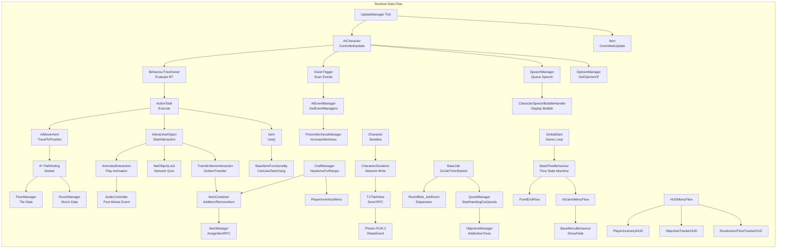

This wiki documents the decompiled source code of **The Escapists 2** (`Assembly-CSharp.dll`). It covers the core game systems, architecture patterns, and implementation details across the entire codebase.

## Architecture Overview

```mermaid
flowchart TB
  subgraph Framework["T17 Framework"]
    T17MB["T17MonoBehaviour"]
    T17NB["T17NetworkBehaviour"]
    T17NM["T17NetManager"]
    GS["GlobalStart"]
    BM["BaseMenuBehaviour"]
    BF["BaseFlowBehaviour"]
  end

  subgraph Characters["Characters & AI"]
    CH["Character"]
    AIC["AICharacter"]
    AIG["AICharacter_Guard"]
    AII["AICharacter_Inmate"]
    AID["AICharacter_Dog"]
    AIM["AICharacter_Medic"]
    AIP["AIPlayer"]
    PS["PrisonAlertnessManager"]
    SM["SpeechManager"]
    OM["OpinionManager"]
    RM["RoutineManager"]
    EVT["AIEventManager"]
    VM["VisionTrigger"]
  end

  subgraph Items["Items & Crafting"]
    IT["Item"]
    ID["ItemData"]
    IM["ItemManager"]
    IC["ItemContainer"]
    CM["CraftManager"]
    BFUNC["BaseItemFunctionality"]
    IPB["ItemProcessorBase"]
  end

  subgraph Interactions["Interactions & Minigames"]
    IO["InteractiveObject"]
    AIO["AnimatedInteraction"]
    TI["TransferItemsInteraction"]
    MII["MultistageInputInteraction"]
    CEI["ConstructEndgameInteraction"]
    DI["DeskInteraction"]
    TI2["ToiletInteraction"]
    GI["GymInteraction"]
    MB["MasherBase"]
    MM["MinigameMap"]
    AC["AudioController"]
  end

  subgraph Prisons["Prisons & Levels"]
    LS["LevelScript"]
    PD["PrisonData"]
    LDM["LevelDataManager"]
    LVM["LevelDetailsManager"]
    FM["FloorManager"]
    RB["RoomBlob"]
    RMF["RoomManager"]
    BLM["BuildingBlockManager"]
    BIM["BuildingInstructionManager"]
    LEC["LevelEditor_Controller"]
    CAM["CameraManager"]
    WE["WeatherEffectManager"]
  end

  subgraph Multiplayer["Multiplayer & Networking"]
    TNV["T17NetView"]
    TNSB["T17NetSyncBehaviour"]
    TNRGV["T17NetRoomGameView"]
    TNCA["T17NetConnectAndJoinRoom"]
    NCO["NetCharacterObserved"]
    NPO["NetPlayerObserved"]
    NOL["NetObjectLock"]
    TLS["T17NetLoadSync"]
  end

  subgraph Jobs["Jobs & Quests"]
    BJ["BaseJob"]
    JM["JobsManager"]
    QM["QuestManager"]
    OBM["ObjectiveManager"]
    OBT["ObjectiveTree"]
    BO["BaseObjective"]
    JC["JobCustomerRequester"]
  end

  subgraph UI["UI & Menus"]
    FE["FrontendFlow"]
    IGM["InGameMenuFlow"]
    HUD["HUDMenuFlow"]
    RMU["RootMenu"]
    CR["CraftingMenu"]
    PIM["PlayerInventoryMenu"]
    HUDE["PlayerInventoryHUD"]
  end

  subgraph Cutscenes["Cutscenes & Slate"]
    CS["Cutscene"]
    DC["DirectorCamera"]
    SC["ShotCamera"]
    CMB["CutsceneManagerBase"]
    CSB["CutsceneSpeechBubbleHandler"]
  end

  subgraph AI["NodeCanvas AI"]
    BT["BehaviourTree"]
    BTO["BehaviourTreeOwner"]
    BB["Blackboard"]
    FSME["FSMOwner"]
    DT["DialogueTreeController"]
    ACT["ActionTask"]
    COND["ConditionTask"]
  end

  subgraph ThirdParty["Third-Party Libraries"]
    PUN["Photon PUN 2"]
    ASTAR["A* Pathfinding"]
    NC["NodeCanvas"]
    SLATE["Slate"]
    RW["Rewired"]
    WWISE["Wwise"]
    GA["Google Analytics"]
    EOS["Epic Online Services"]
  end

  subgraph Telemetry["Telemetry & Analytics"]
    GA3["GoogleAnalyticsV3"]
    NA["NetAnalytics"]
    ST["StatsTracking"]
    SCORE["ScoreManager"]
  end

  subgraph Extensions["Extensions & Helpers"]
    EX["Extension Methods"]
    PRNG["PRNG"]
    BFIELD["BitField"]
    DIR["Direction System"]
    POOL["PooledObject"]
    TH["TimeHelper"]
  end

  T17NB --> T17NM
  T17MB --> BM
  T17MB --> BF

  CH --> T17NB
  AIC --> T17MB
  AIG --> AIC
  AII --> AIC
  AID --> AIC
  AIM --> AIC
  AIP --> CH
  RM --> PS
  EVT --> AIC

  IT --> T17MB
  IM --> T17MB
  IC --> T17MB
  CM --> IC
  BFUNC --> IT
  IPB --> IC

  IO --> T17MB
  AIO --> IO
  TI --> AIO
  MII --> TI
  CEI --> MII
  MB --> MM
  AC --> IO

  LS --> T17MB
  RB --> T17MB
  RMF --> T17MB
  FM --> T17MB
  CAM --> T17MB
  BLM --> LS
  BIM --> LS
  LEC --> BIM

  TNV --> PUN
  TNSB --> TNV
  NCO --> TNSB
  NPO --> TNSB
  NOL --> TNV
  TNCA --> T17NM

  BJ --> IT
  BJ --> RB
  QM --> BO
  OBT --> BO

  IGM --> BM
  HUD --> BM
  RMU --> BM
  CR --> BM

  CS --> SLATE
  DC --> SLATE
  CMB --> T17NB

  BT --> NC
  BTO --> NC
  BB --> NC
  AIC --> BTO
  AIC --> BB

  CH -.-> AI
  AIC -.-> AIO
  AIC -.-> IT
  AIC -.-> RB
  AIC -.-> AIO
  AIC -.-> BT
  AIC -.-> AC
  IT -.-> BFUNC
  IO -.-> AC
  TNV -.-> NOL
  T17NM -.-> TNRGV
  BJ -.-> JM
  QM -.-> OBM
  CAM -.-> WH[/"Weather System"\]
  LEC -.-> CAM
  FM --> RB
  BM --> IGM
  BM --> HUD

  GA3 --> GA
  NA --> EOS
  ST --> GA3
  AC --> WWISE
```

```mermaid
flowchart LR
  subgraph Inheritance["Class Inheritance Hierarchy"]
    direction TB
    MB["MonoBehaviour"]
    T17MB["T17MonoBehaviour"]
    T17NB["T17NetworkBehaviour"]
    CH["Character"]
    AIC["AICharacter"]
    IO["InteractiveObject"]
    AIO["AnimatedInteraction"]
    BM["BaseMenuBehaviour"]
    BF["BaseFlowBehaviour"]
    BJ["BaseJob"]

    MB --> T17MB
    MB --> T17NB
    T17NB --> CH
    T17MB --> AIC
    T17MB --> IO
    T17MB --> BM
    T17MB --> BF
    T17MB --> BJ
    IO --> AIO

    subgraph AIChars["AICharacter Subtypes"]
      AIC --> AIG["AICharacter_Guard"]
      AIC --> AII["AICharacter_Inmate"]
      AIC --> AID["AICharacter_Dog"]
      AIC --> AIM["AICharacter_Medic"]
      AIC --> AIMM["AICharacter_MaintenanceMan"]
      AIC --> AIJC["AICharacter_JobCustomer"]
      AIC --> AIJO["AICharacter_JobOfficer"]
      AIC --> AICR["AICharacter_CrowdNPC"]
      AIC --> AIGH["AICharacter_Ghost"]
    end

    subgraph InteractSubs["Interaction Subtypes"]
      AIO --> TI["TransferItemsInteraction"]
      AIO --> DI["DeskInteraction"]
      AIO --> TI2["ToiletInteraction"]
      AIO --> GI["GymInteraction"]
      AIO --> MI["MinigameInteraction"]
      AIO --> CEIB["ConstructEndgameInteraction"]
      TI --> MII["MultistageInputInteraction"]
      MII --> CEI["ConstructEndgameInteraction"]
    end

    subgraph MenuSubs["Menu Hierarchy"]
      BM --> FMB["FrontendMenuBehaviour"]
      BM --> GMB["GameMenuBehaviour"]
      BM --> BIP["BaseIngamePassiveUI"]
      BM --> BOPT["BaseOptionItem"]
    end

    subgraph JobSubs["Job Hierarchy"]
      BJ --> BCJ["BaseCustomerJob"]
      BJ --> HHJ["HandymanJob"]
      BJ --> PIJ["ProcessItemJob"]
      BJ --> CIJ["CarriedInputJob"]
    end

    subgraph FlowSubs["Flow Hierarchy"]
      BF --> FF["FrontEndFlow"]
      BF --> LF["LevelFlow"]
      BF --> HF["HUDMenuFlow"]
      BF --> IGF["InGameMenuFlow"]
      BF --> RF["ResultsFlow"]
    end
  end
```

## Getting Started

The codebase is organised into these major areas:

<Cards>
  <Card title="Prisons & Levels" href="/docs/PrisonAndLevel" description="Describes how prison environments, tile grids, rooms, lighting, and the level editor work" />
  <Card title="Characters & AI" href="/docs/CharacterAndAI" description="Describes how NPC behaviour, pathfinding, routines, combat, speech, and the opinion system work" />
  <Card title="Items & Crafting" href="/docs/ItemsAndCrafting" description="Describes how items, inventory, containers, crafting recipes, and item functionalities work" />
  <Card title="Multiplayer & Networking" href="/docs/MultiplayerAndNetworking" description="Describes how Photon PUN 2 networking, lobbies, matchmaking, and state sync work" />
  <Card title="Jobs & Quests" href="/docs/JobsAndQuests" description="Describes how prison jobs, quests, favours, and the objective tree system work" />
  <Card title="Interactions, Minigames & Audio" href="/docs/InteractionsMinigamesAudio" description="Describes how interactive objects, minigames, and the audio system work" />
  <Card title="T17 Framework" href="/docs/T17Framework" description="Describes how Team17's internal framework, managers, and base classes work" />
  <Card title="UI & Menus" href="/docs/UIAndMenus" description="Describes how in-game menus, HUD elements, and the Slate UI framework work" />
  <Card title="Node Canvas AI" href="/docs/NodeCanvasAI" description="Describes how behaviour trees, action tasks, and AI decorators work" />
  <Card title="Third-Party Libraries" href="/docs/ThirdPartyLibraries" description="Lists every external namespace found in the decompiled codebase" />
</Cards>

## Prerequisites

- The game runs on **Unity** with **Photon PUN 2** networking
- AI behaviour uses **NodeCanvas** behaviour trees
- Pathfinding uses the **A\* Pathfinding Project**
- Cutscenes use [Slate](https://slate.paradoxnotion.com/) by [ParadoxNotion](https://paradoxnotion.com/)
